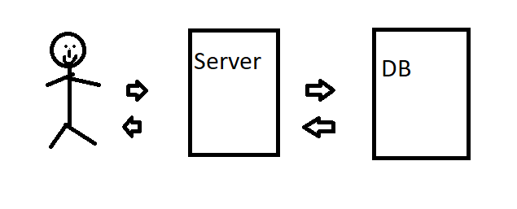
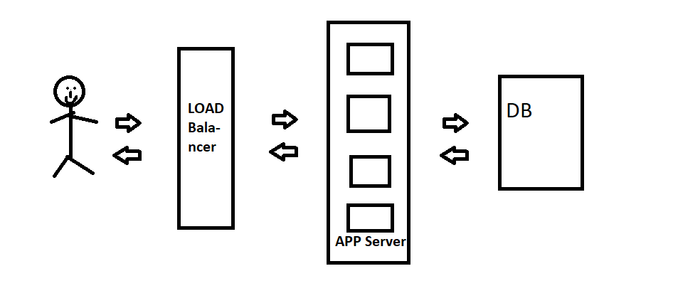
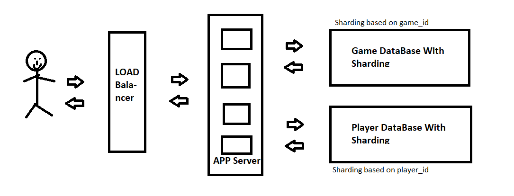
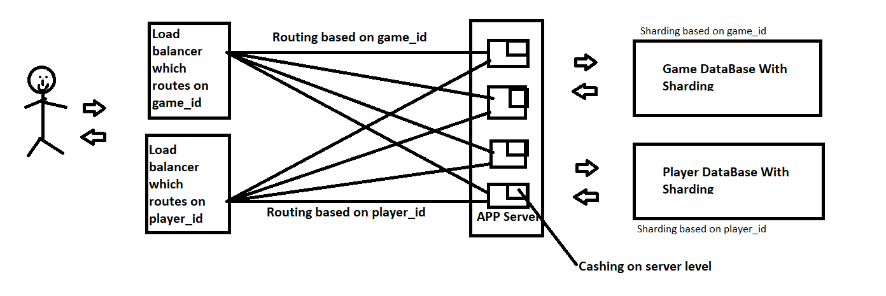

# WHY

Why did we choose this Game? 

1. **MultiPlayer Game**, So we will have to look into multi-threading and concurrency.
1. **Connections** need to be maintained by Pooling, Heartbeats etc..
1. **Game** needs to have a _state_ at any given point in time maintained by some DB.
1. **Player Accounts** management need to be done line _Authentication_. 
1. **Online** game needs to be _deployed_.
1. **Bot** Ellen bot needs to be implemented too(some algo).

All these challenges make this game interesting to learn for a beginner for a full fledged Knowledge of backend.

# HLD
So lets start developing the High Level Design for this game.
Lets do simple one first.
##### Will this work?

### Server

Lets say our game is popular and has 100,000 active player per month out of 1 million player who downloaded the game.And daily 1000 player on online at any given moment.But at peek times like say 6:00pm there ar 10,000 player online. 

_TODO:: calculations on thy this is not possible_

So, ya this will not work and serve load needs to be Balanced.
That menace using multiple servers. 
If you are having multiple serves you better have a Load Balancer.

### Data Base
Now what about DB? Is DB sharding required?

lets say a player players 1000 game on an average.And if we are storing Questions and Answer that were played in the given game.

=> Data stored = no. of player * games played * data in a game

=> Data stored = 1mill * 1000 * (single game Data)

=> Data stored = 1Bill * (single game Data) 

This data is too huge to be stored in a single DB. So DB sharding is required.

Now how do we shard the data. Based on what?

While designing this we need to know the downsides of sharding like **Joins will become expensive** so we need to shard by an attribute which will not be user to join by like 
* **player id**
Two player data will rarely be merged in over use case so _player_id_ seem to be a good choice. But for that to be possible __game data__ should be kept separately form __player data__ 
* **game id**
Two game data will rarely be merged so _game_id_ is a good option too.

So now we have 2 DB's each with its one sharding.

### Load Balancer

So over aim is to distribute the incoming requests equally to all the DB's present.That can be done via randomly distributing the requests to servers.This would work.But will redirect the same(same state) call to different serves so cashing would not be possible. But we need cashing so this is not the solution for us.

We will use **consistent hashing** to send particular request to particular server and still maintain the equal load distribution of requests on servers.

So now that we are using consistent hashing we need a hash id on which hashing occurs.

Will _player_id_ be a good option to that ?

Lets say 3 player are playing.Player 1 (form USA), Player 2 (from India) and Player 3 (from Japan). All these requests will be routed to different servers as they are in different locations. So this will NOT work.

Will _game_id_ be a good option to that ?

The request for the game will be routed to only one server and one DB update will happen which is good. So this seems to work.

But what about the requests which have nothing to do with games like player profile data. How will those be routed?

To do this lets another load balancer which will route based on _player_id_ and will handle all the queries where only player data is updated not game data.

Now over architecture looks some thing like this...

